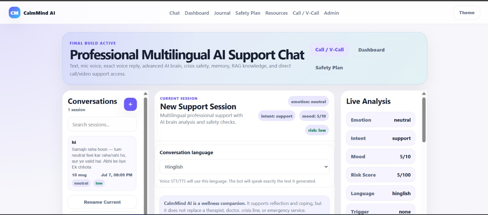
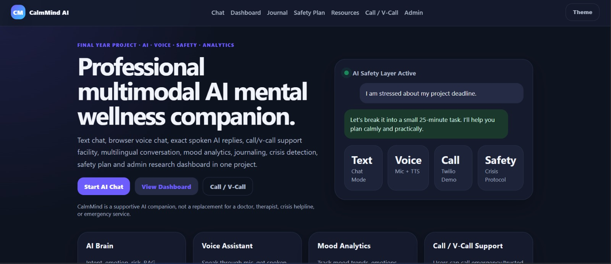
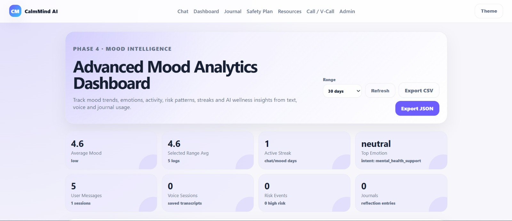
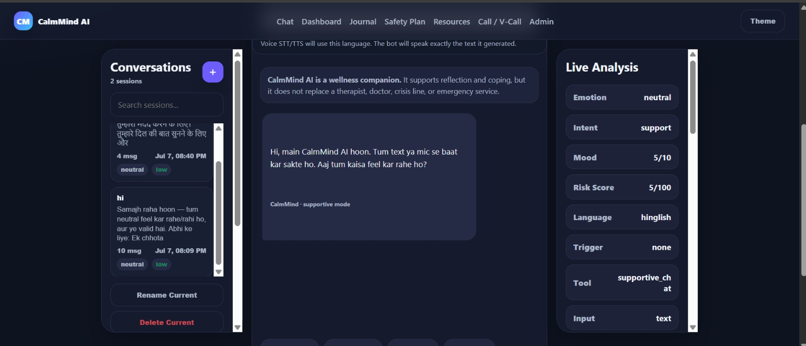
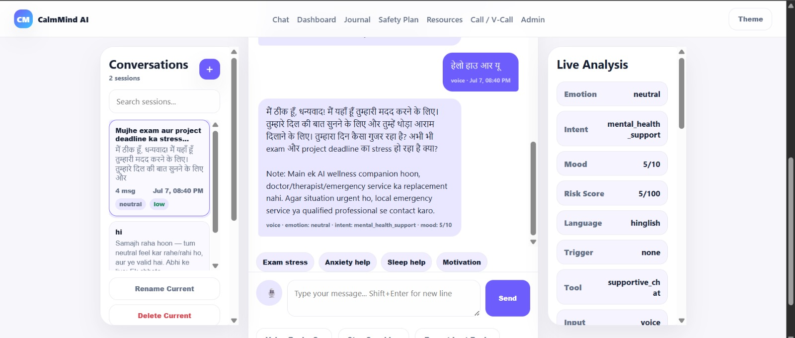
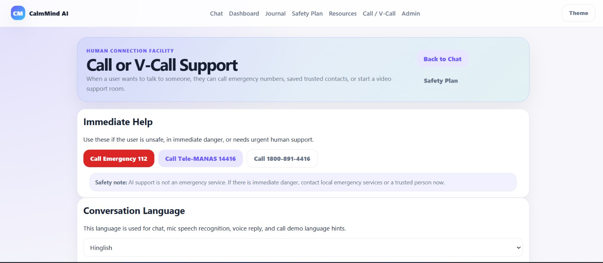

<div align="center">

# 🧠 AI Mental Health Chatbot

### AI-Powered Mental Health Support System using Groq (LLaMA 3), Flask & NLP

<p align="center">


</p>

> Intelligent AI companion for emotional support, mood tracking, journaling and crisis assistance.

</div>

---

# 📑 Table of Contents

- Project Overview
- Features
- Tech Stack
- Project Structure
- Installation
- Environment Variables
- System Architecture
- Screenshots
- Modules
- Future Enhancements
- Security
- Developer
- Disclaimer
- License

---

# 📌 Project Overview

Mental health challenges such as stress, anxiety and depression affect millions of people worldwide.

This project provides an AI-powered chatbot capable of:

- Understanding emotions
- Generating empathetic responses
- Tracking mood history
- Maintaining journals
- Providing emergency support resources

Built using **Flask**, **Groq API**, **LLaMA 3**, **SQLite**, and **Natural Language Processing (NLP)**.

---

# ✨ Features

| Feature | Status |
|----------|--------|
| AI Chat | ✅ |
| Emotion Detection | ✅ |
| Sentiment Analysis | ✅ |
| Voice Input | ✅ |
| AI Voice Response | ✅ |
| Mood Dashboard | ✅ |
| Journal | ✅ |
| Conversation History | ✅ |
| Safety Planning | ✅ |
| Emergency Contacts | ✅ |
| Admin Dashboard | ✅ |
| SQLite Database | ✅ |

---

# 🛠 Technology Stack

## Frontend

- HTML5
- CSS3
- JavaScript

## Backend

- Python
- Flask
- Flask-CORS
- Flask-SocketIO

## Artificial Intelligence

- Groq API
- LLaMA 3.3 70B
- NLP
- Sentiment Analysis

## Database

- SQLite

---

# 📂 Project Structure

```text
AI-Mental-Health-Chatbot/

├── app.py
├── config.py
├── requirements.txt
├── README.md
├── .env.example
├── routes/
├── services/
├── templates/
├── static/
├── tests/
├── screenshots/
└── docs/
```

---

# 🚀 Installation

### Clone Repository

```bash
git clone https://github.com/amittthakur2156/AI-Mental-Health-Chatbot.git
```

```bash
cd AI-Mental-Health-Chatbot
```

### Create Virtual Environment

```bash
python -m venv venv
```

### Activate Environment

Windows

```bash
venv\Scripts\activate
```

Linux / macOS

```bash
source venv/bin/activate
```

### Install Requirements

```bash
pip install -r requirements.txt
```

---

# ⚙️ Environment Variables

Create a `.env` file.

```env
GROQ_API_KEY=your_groq_api_key
GROQ_CHAT_MODEL=llama-3.3-70b-versatile
GROQ_TTS_MODEL=playai-tts
GROQ_TTS_VOICE=Fritz-PlayAI
```

---

# ▶️ Run Project

```bash
python app.py
```

Open

```
http://127.0.0.1:5000
```

---

# 🏗 System Architecture

```text
User

↓

Flask Routes

↓

NLP + Sentiment Analysis

↓

Emotion Detection

↓

Groq API (LLaMA 3)

↓

AI Response Generation

↓

SQLite Database

↓

Dashboard & History
```

---

# 📸 Screenshots

## 🏠 Home



## 💬 Chat



## 📊 Dashboard



## 📜 History



## 🎤 Voice



## ☎️ Helpline




---

# 📦 Modules

- Home
- AI Chat
- Voice Chat
- Mood Dashboard
- Journal
- Safety Plan
- Emergency Contact
- Chat History
- Admin Dashboard

---

# 📈 Project Statistics

| Item | Count |
|------|------:|
| Files | 57+ |
| Lines of Code | 7000+ |
| Services | 10+ |
| Routes | 8+ |
| Templates | 9+ |
| Test Files | 5+ |

---

# 🔒 Security

- API Keys stored using Environment Variables
- `.env` excluded from Git
- Sensitive credentials never committed
- Secure backend configuration

---

# 🚀 Future Enhancements

- Android App
- iOS App
- Video Consultation
- Doctor Appointment
- Cloud Deployment
- AI Prediction
- Wearable Integration
- Personalized Therapy

---

# 👨‍💻 Developer

## Amit Thakur

**Bachelor of Technology (Computer Science & Engineering)**

### GitHub

https://github.com/amittthakur2156

---

# ⚠️ Disclaimer

This chatbot provides emotional support and mental wellness guidance.

It is **NOT** a substitute for professional medical advice, diagnosis or treatment.

In case of an emergency, please contact local emergency services or a qualified healthcare professional.

---

# ⭐ Support

If you like this project, don't forget to give it a ⭐ on GitHub.

---

# 📄 License

This project is licensed under the MIT License.